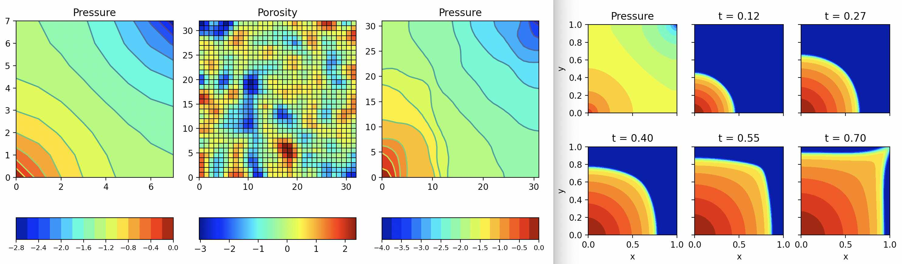

A 2D, two-phase, black-oil, immiscible, incompressible
reservoir simulator
using TPFA (two-point flux approximation).
Both explicit and implicit time steppers are available.
[**Documentation**](https://patnr.github.io/TPFA-ResSim/TPFA_ResSim.html).

Based on [Matlab codes (2007)](http://folk.ntnu.no/andreas/papers/ResSimMatlab.pdf)
from NTNU/Sintef by Jørg E. Aarnes, Tore Gimse, and Knut–Andreas Lie.  
Translated to Python by Patrick N. Raanes.

The Python code produces the same output as the Matlab version
(up to errors from the linear solvers and randomness).
This is verified by the `tests/`, which also serve as **examples**,
producing the following illustrations (with the original "jet" colour maps).

Still, some changes have been made. The *main* ones are:

- `83293bcb`: Converted from 3D to 2D for simplicity.
- `27208d5d`: Index ordering is C-major (numpy standard), not F-major.
- `7543f574`: Vectors are "numpy-thonic", in using 1d arrays, not (2d) columns.
- `cade3156`: Several linear solvers suggested.
- `f33c571a`: OOP
- `55ce7325`: Facilities for working on the grid.
- `e0d12b06`: Convenient well config (ensures total sink + source = 0).

## Used in

Please let me know (or make a PR) if you use this in your work,
and I will add it to this list.

- [History matching tutorial](https://github.com/patnr/HistoryMatching)

## Installation

Prerequisites: Python `>= 3.9` with a
virtual environment from `conda` or `venv` or `virtualenv`, etc...

#### *Either*: As dependency

`pip install git+https://github.com/patnr/TPFA-ResSim.git`

*NB*: This will install it somewhere "hidden" among your other python packages.
Thus, it will be easy to import, but hard to modify.
If you want to play around with the model, install for development:

#### *OR*: For development

Clone (or download and unzip) this repo, `cd` into it, then do `pip install -e .`

## Contributions

Get [poetry](https://python-poetry.org/) and do `poetry install`,
which will give you a new venv with very same dev-environment that I used,
after which you can run the tests with `pytest` (no args),
and linting with `flakeheaven lint`.

#### Suggestions (ToDo)

- Typing: I don't know anything about it, so contributions are most welcome.
  Must be compatible with Python 3.7 (Colab's version).
- Compressibility: Without compressibility the pressure field propagates
  information infinitely fast, which is a little boring.
  It must be carefully considered whether implementing compressibility
  would make the model too complex for its intended use.
