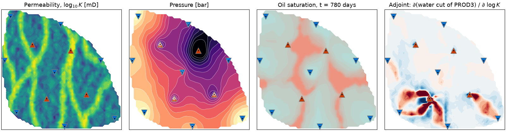
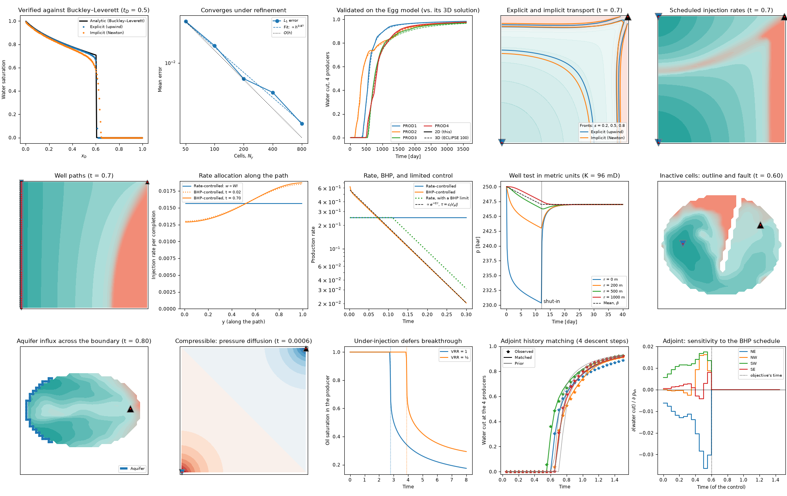

A 2D, two-phase, black-oil, immiscible, ~~incompressible~~
reservoir simulator
using TPFA (two-point flux approximation).
Both explicit and implicit time steppers are available.
[**Documentation**](https://patnr.github.io/TPFA-ResSim/TPFA_ResSim.html).

Based on [Matlab codes (2007)](http://folk.ntnu.no/andreas/papers/ResSimMatlab.pdf)
from NTNU/Sintef by Jørg E. Aarnes, Tore Gimse, and Knut–Andreas Lie.  
The Python code produces the same output as the Matlab version
(up to errors from the linear solvers and randomness), including the illustrations below.
Still, some changes have been made -- 2D instead of 3D, C-major index ordering,
OOP, convenient well configuration, plotting, optional compressibility ([CHANGELOG.md](CHANGELOG.md)).

*One waterflood, left to right: the permeability, the pressure it gives,
the water it moves, and the adjoint's sensitivity of the production to it.*

## Examples

The [`examples/`](https://github.com/patnr/TPFA-ResSim/tree/main/examples)
can be run via (e.g.) `python examples/depletion.py`,
and double as regression tests.
Each has a page in the [documentation](https://patnr.github.io/TPFA-ResSim/examples.html).
Both collages are drawn from their results (`pdoc_template/collage.py`);
this one has a panel per feature:

## Used by

Please let me know (or make a PR) if you use this in your work,
and I will add it to this list.

- [History matching tutorial](https://github.com/patnr/HistoryMatching)

## Installation

TODO

## Contributions

Get [uv](https://docs.astral.sh/uv/) and do `uv sync`,
after which you can run the tests with `uv run pytest` (no further args),
and linting with `uv run ruff check`.
