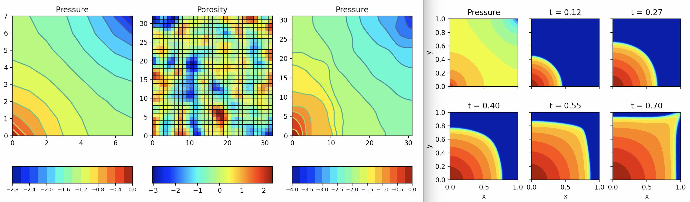

A 2D, two-phase, black-oil, immiscible, ~~incompressible~~
reservoir simulator
using TPFA (two-point flux approximation).
Both explicit and implicit time steppers are available.
Incompressible by default, but slight compressibility can be enabled
(via the `ct` attribute), yielding pressure transients/dynamics,
and permitting unbalanced injection/production (e.g. primary depletion).
[**Documentation**](https://patnr.github.io/TPFA-ResSim/TPFA_ResSim.html).

Based on [Matlab codes (2007)](http://folk.ntnu.no/andreas/papers/ResSimMatlab.pdf)
from NTNU/Sintef by Jørg E. Aarnes, Tore Gimse, and Knut–Andreas Lie.  
Translated to Python by Patrick N. Raanes.

The Python code produces the same output as the Matlab version
(up to errors from the linear solvers and randomness).
This is verified by the `examples/`, which also serve as the **test suite**,
producing the following illustrations (with the original "jet" colour maps).

Still, some changes have been made -- 2D instead of 3D, C-major index ordering,
OOP, convenient well configuration, plotting, optional compressibility.
These are itemised, along with the release history, in [CHANGELOG.md](CHANGELOG.md).

## Examples

Run any of them as a script, e.g. `python examples/depletion.py`.
They double as regression tests: `tests/test_examples.py` runs them all
(plotting included) and compares the output with `tests/references.py`.

- `heterogeneous.py` and `quarter_five_spot.py` reproduce Figs. 1 and 6 of the
  reference paper. The latter is what verifies our agreement with the Matlab codes.
- `rate_scheduling.py` steers the water front using time-varying injection rates.

The remaining ones illustrate what slight compressibility (`ct > 0`) brings:

- `pressure_diffusion.py`: the pressure equation becomes parabolic, so that a
  change of rate propagates at *finite speed* (diffusivity `η = K λ / (φ ct)`),
  instead of being felt everywhere instantaneously. Also illustrates that the
  pressure level is now meaningful (anchored by `p0`), whereas the incompressible
  pressure is only defined up to a constant.
- `depletion.py`: production *without* injection (impossible if incompressible),
  its transient and boundary-dominated regimes, and the resulting material-balance
  decline, `dp̄/dt = -q / (ct Vp)`.
- `buildup.py`: shutting in a well, and the ensuing pressure buildup. Monitor
  points far from the well respond late -- and keep declining after the shut-in,
  before turning around.
- `voidage_replacement.py`: the only *two-phase* one of these -- waterflooding
  while injecting only half of what is produced (impossible if incompressible).
  The front then advances more slowly, and by a different pattern, since some of
  the oil is instead driven by expansion.

## Used in

Please let me know (or make a PR) if you use this in your work,
and I will add it to this list.

- [History matching tutorial](https://github.com/patnr/HistoryMatching)

## Installation

Prerequisites: Python `>= 3.9` with a
virtual environment from `conda` or `venv` or `virtualenv`, etc...

#### *Either*: As dependency

`pip install git+https://github.com/patnr/TPFA-ResSim.git`

*NB*: This will install it somewhere "hidden" among your other python packages.
Thus, it will be easy to import, but hard to modify.
If you want to play around with the model, install for development:

#### *OR*: For development

Clone (or download and unzip) this repo, `cd` into it, then do `pip install -e .`

## Contributions

Get [uv](https://docs.astral.sh/uv/) and do `uv sync`,
which will give you a new venv with very same dev-environment that I used,
after which you can run the tests with `uv run pytest` (no further args),
and linting with `uv run ruff check`.

*PS*: if you use [mise](https://mise.jdx.dev/), the `mise.toml`
places the venv under `~/.cache/venvs/` rather than in-project.
